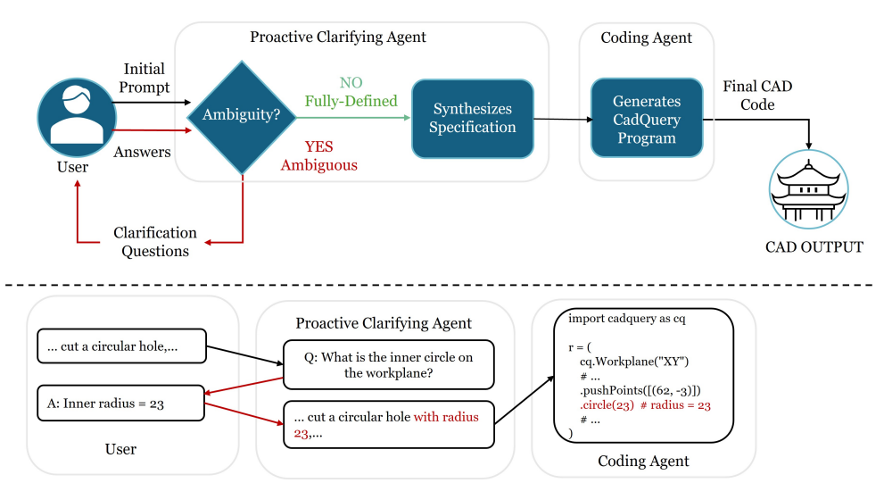

# ProCAD

Official code for **"Clarify Before You Draw: Proactive Agents for Robust Text-to-CAD Generation"** ([arXiv:2602.03045](https://arxiv.org/abs/2602.03045)).



ProCAD is a two-agent system for text-to-CAD generation that **resolves specification issues before code synthesis**:

1. **Clarifier** — detects ambiguous or conflicting prompts and asks targeted clarifying questions
2. **Coder** — converts the clarified description into executable [CadQuery](https://github.com/CadQuery/cadquery) code

Pre-trained checkpoints and data are released on Hugging Face:

- 🧠 **Coder** — [BBexist/ProCAD-coder](https://huggingface.co/BBexist/ProCAD-coder)
- ❓ **Clarifier** — [BBexist/ProCAD-clarifier](https://huggingface.co/BBexist/ProCAD-clarifier)
- 📦 **Dataset** — [BBexist/ProCAD](https://huggingface.co/datasets/BBexist/ProCAD)

---

## Installation

ProCAD ships with an [Apptainer](https://apptainer.org/) definition file (`cad-agent.def`) that pins the exact runtime used in the paper.

```bash
git clone https://github.com/BoYuanVisionary/Pro-CAD.git
cd Pro-CAD

# Build the image once
apptainer build cad-agent.sif cad-agent.def

# Open a GPU shell with your data mounted
singularity shell --nv --bind /path/to/data:/data cad-agent.sif
```
## Configuration

Copy the example config and set your API keys via environment variables:

```bash
cp config/config.yaml.example config/config.yaml

export OPENAI_API_KEY=sk-...
export ANTHROPIC_API_KEY=sk-ant-...
export OPENROUTER_API_KEY=sk-or-...
```ss
### Environment variables

| Variable | Used by | Default |
|---|---|---|
| `OPENAI_API_KEY` / `ANTHROPIC_API_KEY` / `OPENROUTER_API_KEY` | LLM API clients | — |
| `DATA_ROOT` | DeepCAD / text2cad root (mesh + CadQuery GT) | `./data` |
| `DEEPCAD_PATH` | Local DeepCAD repo (used by `src/preprocessing.py`) | `./data/DeepCAD` |
| `GT_MESH_DIR` | Ground-truth STL meshes (`pipeline.py`, `batch_label.py`) | `./data/text2cad/deepcad_mesh` |
| `UID_FILE` | Train/val/test UID split (`generate_misleading.py`) | `./dataset/train_val_test.json` |
| `IMPROVED_DATA_DIR` | `improved.json` file or dir (`generate_misleading.py`) | `./sft/improved_data` |
| `MISLEADING_JSON` | Filtered misleading samples for the pipeline (`pipeline.py`) | `./dataset/selected_misleading_samples_test` |
| `BATCH_DATA_DIR` | Input for `generate_misleading.py` | `./sft/filter_data` |
| `MISLEADING_OUTPUT_DIR` | Output dir for `generate_misleading.py` (overrides per-type default) | — |
| `OUTPUT_DIR` | Clarification pipeline results (`pipeline.py`) | `./clarification_results` |
| `CLARIFY_AGENT_MODEL` | Clarifier model id (`pipeline.py`) | `gpt-4o-mini-2024-07-18` |
| `ANSWER_MODEL` | User-simulator model id (`pipeline.py`) | `gpt-5-mini-2025-08-07` |
| `CODE_GEN_MODEL` | Coder model id or local path (`pipeline.py`) | `BBexist/ProCAD-coder` |
| `TOOLS_DIR` | Auxiliary tool path (`batch_label.py`) | `.` |

## Data

Grab the four dataset files from [`BBexist/ProCAD`](https://huggingface.co/datasets/BBexist/ProCAD) with `hf download BBexist/ProCAD --repo-type dataset --local-dir ./dataset`; for Chamfer evaluation, obtain the ground-truth STL meshes from [DeepCAD](https://github.com/ChrisWu1997/DeepCAD) and point `GT_MESH_DIR` at them.

## Quick start

Run the full clarification pipeline on the misleading test split:

```bash
python pipeline.py \
  --json_path dataset/selected_misleading_samples_test \
  --output_dir ./clarification_results
```

## Training

SFT uses [LLaMA-Factory](https://github.com/hiyouga/LLaMA-Factory). See `training/README.md` for setup (install LLaMA-Factory, then copy the ProCAD data + configs from `training/`).

Two configs are provided:s

| Config | Role |
|---|---|
| `training/configs/qwen2-5_full_sft.yaml` | **Coder** — CadQuery code generation |
| `training/configs/qwen2-5_full_sft_misleading.yaml` | **Clarifier** — misleading-prompt detection + clarifying questions |

Released checkpoints: [**BBexist/ProCAD-coder**](https://huggingface.co/BBexist/ProCAD-coder) · [**BBexist/ProCAD-clarifier**](https://huggingface.co/BBexist/ProCAD-clarifier).

---

## Repository layout

### Top-level scripts

| Script | Purpose |
|---|---|
| `pipeline.py` | **Main entry.** Full clarification pipeline in batches: detect misleading → ask/answer → corrected CadQuery → Chamfer eval |
| `batch_label.py` | Batch LLM labeling + Chamfer eval over splits |
| `generate_misleading.py` | Generate misleading prompts (`--type underspec` or `--type conflict`, K=1,2,3) |
| `check_leakage.py` | Detect raw-code leakage in modified prompts |
| `to_sft.py` | Convert misleading samples to SFT conversation format |
| `analyze_results.py` | Success rate, Chamfer stats, question-quality / ambiguity-resolution judges |

### `config/`

| File | Purpose |
|---|---|
| `config.yaml.example` | Model + API settings template (copy to `config.yaml`, uses `${ENV_VAR}`) |
| `clarification.py` | Clarifier prompts and judge prompts |
| `code_generation.py` | CadQuery code-generation prompts |
| `code_leakage_check.py` | Code-leakage detection prompts |
| `misleading_prompt.py` | Ambiguity-type library |
| `ambiguity_under_specified.py` | Few-shot examples — missing/under-defined parameters |
| `direct_conflict_same_feature_two_values.py` | Few-shot examples — conflicting values |
| `prompt_comparison.py` | GPT-based description comparison |
| `prompt_verification.py` | Description ↔ code consistency check |
| `prompts.py` | General CAD code-generation prompt |

### `src/`

| File | Purpose |
|---|---|
| `ask_agent.py` | `AskAgent` — detects ambiguity, generates clarifying questions |
| `inference.py` | Unified LLM wrapper (OpenAI-compatible API or local HF transformer) |
| `evaluation.py` | Chamfer distance, judge F1/precision/recall for question quality |
| `mesh_utils.py` | STL loading, point-cloud sampling, CadQuery → mesh |
| `data_loader.py` | Dataset loaders and UID/description/code/mesh accessors |
| `preprocessing.py` | Build meshes from DeepCAD JSON, filter near-duplicates |
| `processing.py` | Filter samples by Chamfer criteria |
| `user.py` | Simulated user (expert/intermediate/novice/confused personas) |
| `visualization.py` | Headless mesh/point-cloud rendering |

### `training/`

Project-specific SFT deltas — data files, `dataset_info.json` fragment, and training YAMLs for LLaMA-Factory. See `training/README.md`.

---

## Citation

```bibtex
@article{yuan2026procad,
  title   = {Clarify Before You Draw: Proactive Agents for Robust Text-to-CAD Generation},
  author  = {Yuan, Bo and Zhao, Zelin and Molodyk, Petr and Hu, Bin and Chen, Yongxin},
  journal = {arXiv preprint arXiv:2602.03045},
  year    = {2026}
}
```

## License

Released under the [Apache License 2.0](https://www.apache.org/licenses/LICENSE-2.0).

## Acknowledgements

ProCAD partially uses code and dataset from these excellent projects — thanks to their authors:

- [**DeepCAD**](https://github.com/ChrisWu1997/DeepCAD) — Wu et al., *"DeepCAD: A Deep Generative Network for Computer-Aided Design Models"* (ICCV 2021). Source of the CAD sequences and ground-truth meshes used for evaluation.
- [**Text2CAD**](https://github.com/SadilKhan/Text2CAD) — Khan et al., *"Text2CAD: Generating Sequential CAD Models from Beginner-to-Expert Level Text Prompts"* (NeurIPS 2024). Source of expert-level text prompts and dataset splits.
- [**cadrille**](https://github.com/col14m/cadrille) — Kolodiazhnyi et al., *"cadrille: Multi-modal CAD Reconstruction with Online Reinforcement Learning"* (ICLR 2026). Base of the container environment (`cad-agent.def`) and the CadQuery execution harness.
